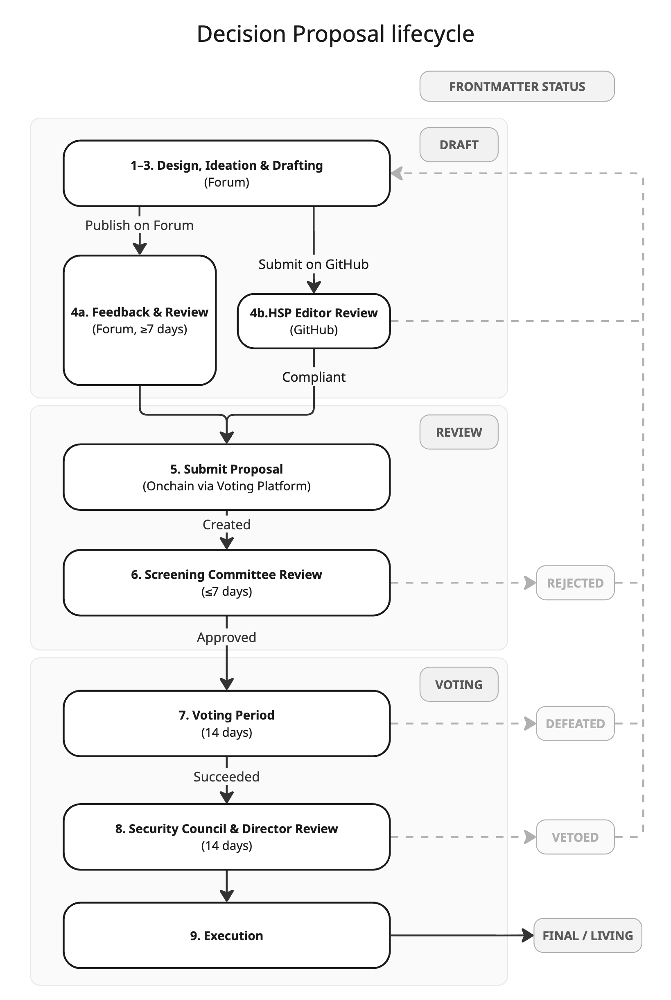

# NEAR House of Stake Proposals and Voting Guide

This Guide is written for those who want to put forward a proposal to the House of Stake. It will help you understand the overall process, write a great proposal, get feedback on it and submit it to a vote.

It outlines the procedures that must be followed by an HSP Author, as well as the mechanics of how Voting works, based on the [Proposal and Voting Procedures](https://gov.near.org/t/hsp-xxx-near-house-of-stake-proposals-and-voting-procedures/42019), which is the authoritative definition of those procedures. Use this Guide alongside the Procedures document, not instead of it.

You can see examples of previously submitted proposals in the [houseofstake/proposals GitHub repo](https://github.com/houseofstake/proposals/tree/main/HSPs).

## Proposal Lifecycle overview

Any NEAR Tokenholder can create and submit a proposal to House of Stake. Such proposals are referred to as **House of Stake Proposals ("HSPs")** and when you create one, you are the **HSP Author**.

You can see here the overall steps a proposal goes through (described in more detail below) and how the proposal status changes as it transitions through these:



Overall, a proposal typically requires a minimum of 28–42 days to complete the decision-making process.

## STEP 1: Design your Proposal

You can create a proposal in any of these categories:

- **Economic Governance** - Treasury, inflation, fees, token economics
- **Technical Governance** - Protocol changes, smart contracts, infrastructure
- **Legitimacy & Engagement** - Policies, procedures, community initiatives
- **Grants & Funding** - Grant programs, funding allocations
- **Operations** - House of Stake operational matters
- **Other** - Proposals that don't fit above categories

Good proposals will have strong alignment with NEAR House of Stake's [Mandate](https://gov.near.org/t/house-of-stake-mandate/41652) and [Mission-Vision-Values](https://gov.near.org/t/hsp-xxx-near-house-of-stake-mission-vision-values/42052), so be sure to get familiar with these before starting to design your proposal.

Proposals should:

- **Solve a clear problem** - Articulate the issue and why it matters.
- **Provide a complete specification** - Include enough detail for implementation.
- **Show net improvement** - Demonstrate that benefits outweigh costs and risks.
- **Build consensus** - Engage with community feedback and address concerns.
- **Be well-scoped** - Focus on a single proposal or a tightly related set of changes.
- **Consider alternatives** - Explain why this approach vs. others.
- **Address security** - Discuss security implications thoroughly.

You don't need to have it all figured out to start: the next step is all about engaging the community of NEAR stakeholders to get there.

You can also [reach out to the House of Stake team](https://t.me/NEAR_HouseOfStake) to receive support in developing your proposal, including to get help with using Markdown and GitHub when it comes to drafting your HSP.

## STEP 2: Ideation with the community to develop your proposal

Successful proposals don't usually come from a vacuum or a single brilliant idea: they come from a deep understanding of an important issue and how that impacts or will benefit people, solving real problems for them.

Use the [NEAR Governance Forum](https://gov.near.org/c/house-of-stake) to engage with others, ask questions and understand different perspectives. Share your idea, get feedback and develop it in collaboration with others.

Being engaged on the Forum helps you establish a minimum trust level that will be required to succeed. You can start activating key stakeholders and [delegates](https://gov.houseofstake.org/delegates) who will later vote on your proposal.

## STEP 3: Draft your HSP

Once you are ready, you should prepare your proposal as a standardized **House of Stake Proposal (HSP)**, which must follow the template defined in Article 6 of the [Proposal and Voting Procedures](https://gov.near.org/t/hsp-xxx-near-house-of-stake-proposals-and-voting-procedures/42019).

### HSP Tracks and Types

#### Voting Tracks

- **Sensing** - On-chain vote to gauge community sentiment on a topic, without threshold or quorum. These have a 7-day voting period.
- **Decision** - On-chain vote to execute and implement a proposal, provided the required quorum and threshold are met. These have a 14-day voting period.

#### Voting Types

- **Simple Majority** - default, suitable for most proposals → a 50% majority is required to succeed
- **Supermajority** - if it modifies the governance system itself → a two-thirds majority is required to succeed

The following are suggested best practices:

### Shepherding the HSP

- **Vetting the idea** - Discussing on the Forum before writing a formal proposal
- **Writing clearly** - Following the template and writing for a broad audience
- **Building consensus** - Engaging constructively with feedback
- **Iterating** - Refining based on community input
- **Coordinating implementation** - For Decision proposals, working with implementers
- **Documenting dissent** - Noting significant opposing viewpoints

### Style Guidelines

- **Format** - Markdown formatting ([HackMD](https://hackmd.io) is a useful tool for Markdown editing)
- **Titles** - Max 44 characters, descriptive, no HSP number in title
- **Descriptions** - Max 140 characters, complete sentence
- **Dates** - ISO 8601 format (YYYY-MM-DD)
- **Linking** - Other HSPs are linked as `HSP-###`
- **Language** - Clear, accessible, professional, but not overly formal

### Payload use cases:

The payload refers to executable code or text intended for formal adoption, and should display as a collapsible section in the proposal. It is not mandatory for all proposals to have a payload.

### AI tools

You can use https://neargov.ai to assess draft or submitted HSPs against acceptance criteria.

## STEP 4: Publish for Feedback and Review

_In this step, you will publish on the Forum and GitHub for Community Feedback and on GitHub for HSP Editor Review._

1. Publish your draft HSP on the NEAR Forum in the [Proposals category](https://gov.near.org/c/house-of-stake/proposals/168) with:
   - Forum Post title: HSP-XXX: Proposal Title
   - Frontmatter:
     - hsp: \<TBD\>
     - status: Draft
   - Note: When publishing on the Forum, for correct formatting, the Frontmatter should be wrapped in ` ```yaml ` and ` ``` `
2. This initiates the mandatory minimum 7-day feedback period.
   - During this period, the text of the proposal cannot be changed
   - Exception: If a Decision proposal follows a Sensing proposal with no changes made to the text of the proposal, the 7-day requirement does not apply
   - In either case, if you make changes, the 7-day feedback period resets
3. Once you are satisfied with the state of the proposal, create a GitHub PR to add a new file to the [HSPs folder](https://github.com/houseofstake/proposals/tree/main/HSPs) in the `houseofstake/proposals` repository.
   - Frontmatter:
     - discussions-to: \<forum URL\>
   - Note: When submitting the PR on GitHub, to correctly format it as a table, Frontmatter should be at the very top of the MD file and wrapped in `---` and `---`
4. HSP Editor reviews formatting, completeness, and scope compliance.

### If compliant:

- HSP Editor assigns the official HSP number and notifies the HSP Author through the Forum.
- Status is updated to **Review**.
- You should then update your Forum post with the HSP number and updated status.

### If not compliant:

- The HSP Editor will share feedback and requested changes with you against the GitHub PR and/or on the Forum.
- You can then make changes following the HSP Editor's suggestions.
- Changes can be published on the Forum by editing your existing Forum post. You should also post accompanying comments describing the changes you've made and why.
- This starts another 7-day feedback period.
- When you're ready to submit for HSP Editor review again, either update your existing GitHub Pull Request with commit(s) for the revisions you've made, or start a new Pull Request if you prefer.

## STEP 5: Submit Proposal Onchain

Once the 7-day feedback period has passed and you have an HSP number, you can submit the proposal on the [voting platform](https://gov.houseofstake.org/proposals).

- You will pay a small deposit of 0.1013 NEAR to submit a proposal.
- Title should match the Forum Post title, including the HSP number i.e. HSP-XXX: Proposal Title
- Description should contain the full text of the proposal, including any payload and excluding the Frontmatter.
- Link should be the link to the Forum Post

## STEP 6: Screening Committee Review

The Screening Committee will review your proposal and communicate its decision within **7 calendar days**.

Possible outcomes, which are final and recorded onchain, are:

- **Approved**
  - Status updated to _Voting_.
  - Voting Period commences immediately upon approval.
- **Rejected**
  - Status updated to _Rejected_.
  - Feedback will be provided.
  - If you want to resubmit, you must draft a new proposal, with a new HSP number (i.e. starting again at Step 4)

The Committee may exercise discretionary governance judgment, such as bundling complementary proposals into a single vote, reclassifying as Supermajority or suggesting minor corrections to proposal text, without requiring another 7-day feedback period.

## STEP 7: Voting

As the HSP Author, you can participate in the communication and voting on the proposal, in accordance with the NEAR House of Stake Conflict of Interest Policy.

Onchain voting details key to understand are:

### Duration

- Sensing: 7 days.
- Decision: 14 days.

### Voting Power

- Fixed at the moment of Screening Committee approval.
- Based on the veNEAR held by and delegated to each delegate at that time.
- Votes are recorded onchain and they cannot be changed after being cast in a proposal.

### Voting Options

Voting options are **For**, **Against**, and **Abstain**.

Further voting types may be developed in the future to cover specific needs, as progressive decentralization advances.

### Quorum

- Minimum 1,000 veNEAR.
- Abstain counts toward quorum.

### Thresholds

- Simple Majority: ≥ 50%.
- Supermajority: ≥ 2/3.
- Abstain does not count toward the threshold.

### Voting Outcome

- If either quorum or threshold is not met → **Defeated**.
- If quorum and threshold are both met → **Succeeded**.

## STEP 8: Security Council & Director Review

After a successful vote, the Security Council has 14 days to review and veto or suspend the proposal.

**If not vetoed:**

- Forwarded to NEAR House of Stake Foundation Directors for execution, subject to fiduciary duties and applicable law.

**If vetoed:**

- Rationale is shared on the NEAR Forum by the Security Council.
- HSP Status updated to **Vetoed**.

## STEP 9: Execution

If approved for execution:

1. Together with relevant stakeholders, you can proceed with implementation in accordance with the Implementation Plan stated in the HSP.
2. You should be prepared to coordinate with other stakeholders to effectively implement the proposal, reporting regularly on deliverables and success criteria as per the Milestones shared in your HSP.
3. Once implemented, let the HSP Editor know, so that the HSP status can be updated to **Final**.

Implementation timelines are indicative and may be adjusted for legal or operational reasons.

## Unsuccessful Proposals

If a proposal was Rejected, Defeated or Vetoed and you wish to amend and resubmit it, you must create a new proposal, following the full process again.

- **Rejected**: carefully consider the Screening Committee's feedback. What can you learn from what they've shared? Could you adapt your proposal to address their concerns? What further discovery might you need to do to make your proposal more suitable?
- **Defeated**: study the voter breakdown. Which delegates voted for vs. against? Did any provide rationale on the forum? Reach out and ask so you can understand more.
- **Vetoed**: study the rationale of the Security Council. Did they provide any recommendations for potential paths forwards? Could you make adaptations to your proposal to address their concerns?

## Special Cases

- **Withdrawn**: Prior to Voting, the HSP Author may update their proposal status to _Withdrawn_. They can resurrect it and resume the process at any time by changing it back to _Draft_.
- **Stagnant**: If the HSP Author does not reply to comments from the HSP Editor or Screening Committee within 6 months, the status of the proposal will be marked as _Stagnant_. They can resurrect it and resume the process at any time by changing it back to _Draft_.
- **Living** is a status used for Constitutional or other documents that never reach finality, set after they have successfully passed a vote.
