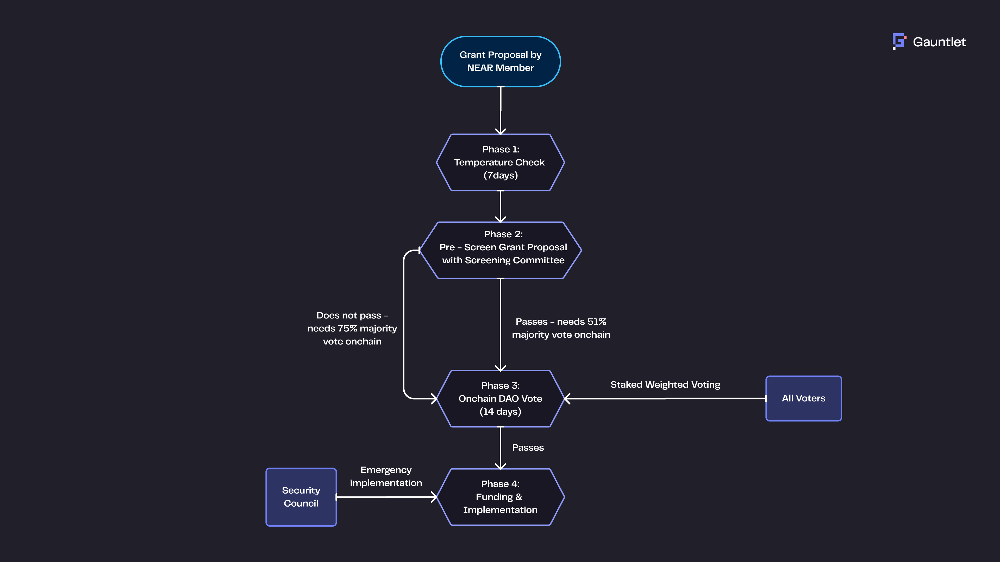

# Proposal & Voting Process {#proposal-voting-process}

House of Stake governance follows a two-stage decision-making flow designed to balance efficiency, inclusiveness, and decentralization.

## Proposal Submission {#proposal-submission}

Anyone can submit a proposal using a standardized template.
Before it proceeds to a vote, the proposal must be posted publicly for feedback and discussion.

- Proposals should clearly define goals, rationale, impact, and requested funding (if any)
- Community feedback helps improve or reject weak proposals early
- Only proposals posted publicly are eligible for further screening

## Pre-screening by Screening Committee {#pre-screening-by-screening-committee}

The Screening Committee evaluates whether a proposal is ready to move forward.
It acts as a quality filter — not a final judge.

- If **4 out of 7 members** approve → the proposal moves to a **simple majority vote (51%)**
- If **fewer than 4 approve** → it must pass with a **supermajority (75%)**
- Pre-screening ensures the voting stage is efficient and less noisy

## On-chain Voting with veNEAR {#on-chain-voting-with-venear}

Proposals that pass screening enter the on-chain voting stage.
veNEAR holders vote directly or via delegates.

- Voting power is proportional to veNEAR balance
- A standard voting period applies (e.g. 5–7 days)
- Final outcomes are determined transparently on-chain

## Transparency & Recordkeeping {#transparency-recordkeeping}

All proposals, screening outcomes, and voting results are archived publicly.
This ensures accountability and lets participants audit governance history
