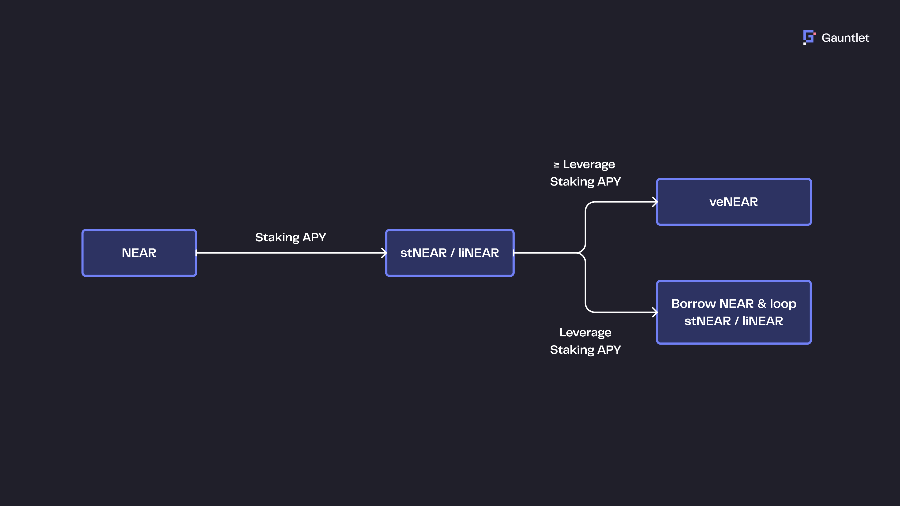
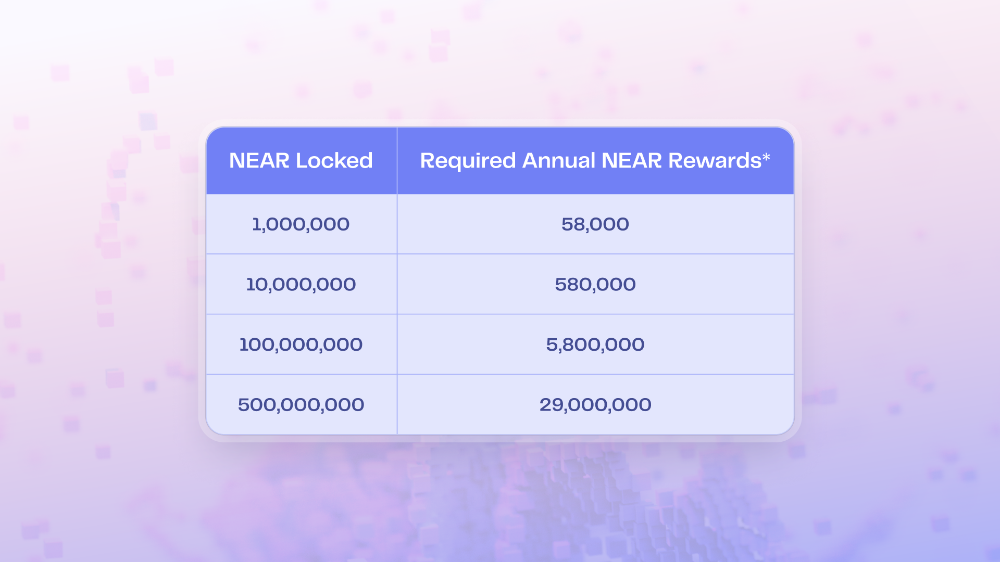
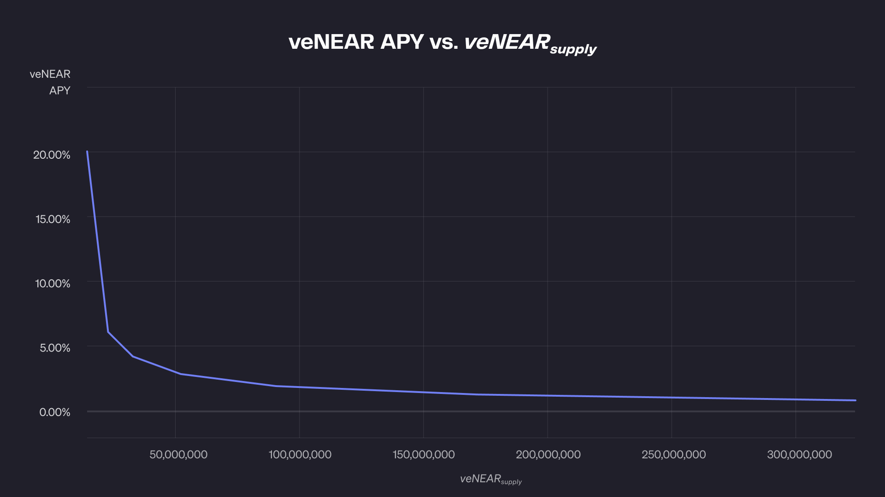
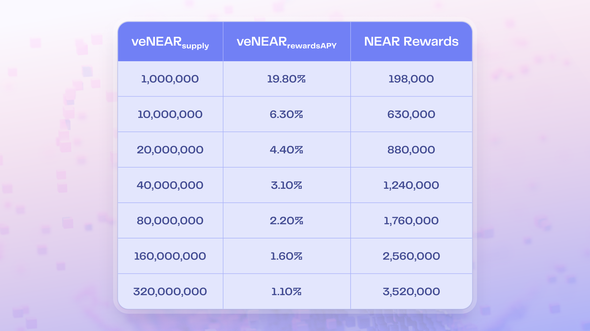
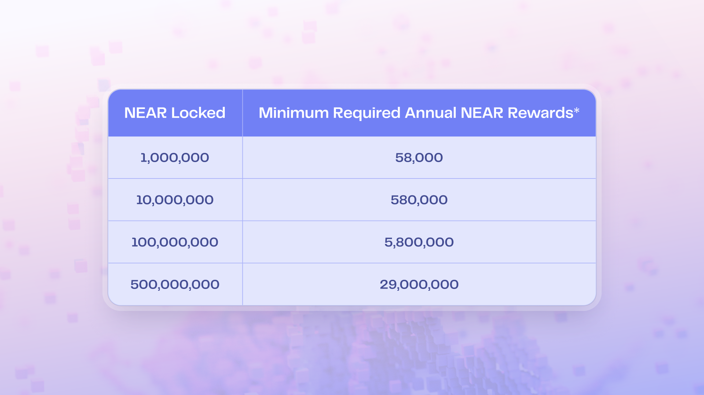

# Rewards & Incentives

House of Stake introduces a structured incentive system to reward meaningful participation in governance, both for veNEAR holders and active delegates.

## 1. Rewards for veNEAR Holders

veNEAR holders receive regular rewards in exchange for locking tokens and participating in governance.



- Funded by 0.5% annual NEAR inflation
- Distributed proportionally based on veNEAR amount and lock duration
- Voting activity may become a requirement to claim rewards
- Rewards must be manually claimed (not automatic)
- Designed to be competitive with DeFi yield (target APY: ~5.8–8.8%)



## 2. Delegate Incentives

Endorsed delegates are eligible for rewards — if they meet certain participation standards:

- Must maintain ≥ 80% voting participation
- Must publish quarterly public updates with rationale for their votes
- Must hold ≥ 0.5% of total veNEAR supply
- Must pass KYC/KYB (for accountability and anti-sybil protection)

Rewards are proportional to stake and participation, encouraging responsible engagement.

## 3. Funding Source

All incentives are paid from a predictable and capped funding stream:

- 0.5% protocol inflation dedicated to governance
- Possible future funding via ecosystem revenue (e.g. protocol fees)
- Sustainable and transparent budgeting model

### 4. Dynamic veNEAR Reward Scaling

As veNEAR adoption grows, governance rewards must scale **transparently** and **sustainably** — without requiring constant manual intervention by the Screening Committee.

To achieve this, `veNEAR_rewardsAPY` can be calculated dynamically based on the current total supply of veNEAR using the following formula:

```math
\text{veNEAR}_\text{rewardsAPY} = \frac{198}{\sqrt{\text{veNEAR}_\text{supply}}}
```

This ensures that:

- Rewards scale **inversely with veNEAR supply**
- APY remains competitive early on
- Total NEAR outflows stay bounded as the system scales

📉 **veNEAR APY vs veNEAR Supply**



📊 **Reward Examples by Supply Level**



## 5. Reward Examples Based on Locked NEAR

To illustrate how veNEAR incentives convert into actual NEAR rewards, here’s an example table based on a 5.8% annual yield.


