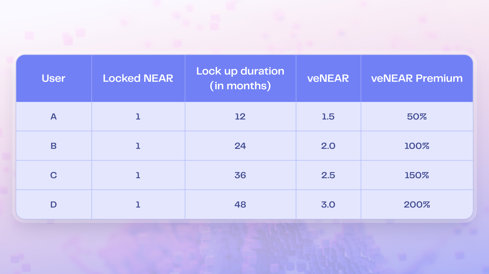
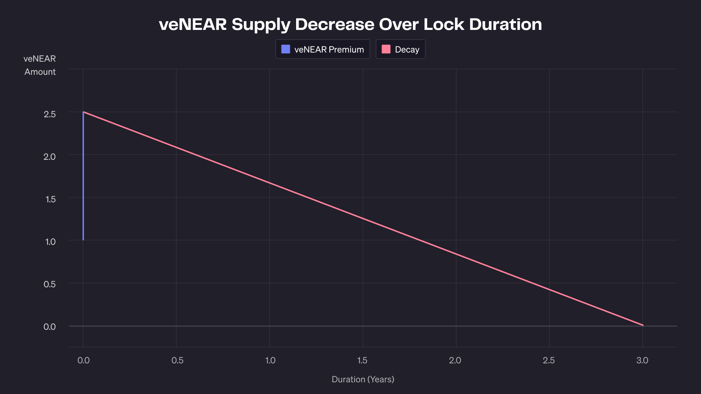

# veNEAR Locking Mechanisms

To obtain veNEAR, users must lock NEAR, stNEAR, or liNEAR tokens in a vote-escrow contract. House of Stake supports two different locking mechanisms: **Fixed Lock** and **Rolling Lock**. Each offers different levels of flexibility and commitment, depending on the user's goals.

## 1. Fixed Lock

Users select a specific lock duration from 3 months to 4 years. The longer the lock period, the greater the veNEAR received. Voting power decays linearly over the lock period until expiration.

- **Minimum lock:** 3 months
- **Maximum lock:** 4 years
- **Conversion rate:** Higher with longer lock durations
- **Use case:** Best for users confident in long-term commitment

When performing a vote-lock, users specify the lock-up duration. Based on the number of tokens deposited and the duration, veNEAR is calculated proportionally.

📊 **Example: veNEAR voting power by lock-up duration**

This example shows how longer commitments unlock greater governance power — rewarding long-term alignment with the NEAR ecosystem.

## 2. Rolling Lock

Users lock tokens indefinitely and accumulate veNEAR over time. They can initiate an unlock at any time, after which a fixed 3-month cooldown begins. veNEAR decays during this period.

- **No need to choose a lock period upfront**
- **veNEAR accumulates linearly over time (up to 4 years)**
- **3-month unlock delay**
- **More flexible exit option for uncertain users**

## Choosing a Locking Mechanism

| Feature          | Fixed Lock                   | Rolling Lock                   |
| ---------------- | ---------------------------- | ------------------------------ |
| Initial choice   | Set duration                 | No initial lock needed         |
| Flexibility      | Low (committed duration)     | High (can unlock anytime)      |
| Max voting power | Yes (at 4-year lock)         | Yes (accumulates over time)    |
| Exit process     | Unlock after set period ends | Start 3-month cooldown anytime |

### 3. Example Comparison: Fixed Lock vs Rolling Lock

Let’s take an example to illustrate the difference between the two locking approaches.

Assume a user deposits **1 NEAR** into veNEAR contracts.

#### 🧱 Approach 1: Fixed Lock

- The user chooses to lock 1 NEAR for **3 years**
- The veNEAR contract calculates voting power using a **v(t)** formula
- veNEAR is granted up front (based on time-weighted multiplier)
- Over time, veNEAR **decays linearly** until reaching zero at the end of 3 years
- NEAR becomes unlockable **only after the full 3 years**

#### 🔄 Approach 2: Rolling Lock

- The user deposits **1 NEAR** without specifying a lock duration
- veNEAR accrues gradually over time (e.g. each epoch)
- After **3 years**, the user initiates the unlock process
- A **3-month cooldown** begins, during which veNEAR **decays linearly to zero**
- Once the cooldown ends, the NEAR becomes withdrawable

