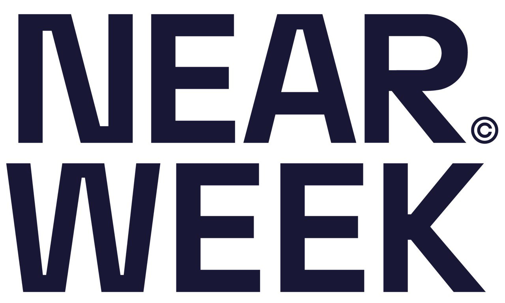
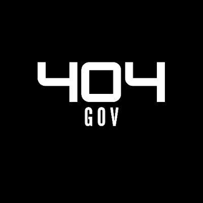

# Delegates & Participants {#delegates-participants}

In House of Stake, **delegates** play a central role in executing governance on behalf of veNEAR holders. They are trusted participants who vote on proposals, help shape the future of the ecosystem, and are expected to act transparently and responsibly.

## Delegates {#delegates}

Delegates receive voting power when other veNEAR holders delegate their tokens to them. To become a delegate, a user must meet certain requirements and publicly commit to participating in governance.

### Responsibilities {#responsibilities}

- Vote actively on governance proposals
- Provide rationale for their decisions
- Engage with the community and answer questions
- Comply with the Code of Conduct and avoid conflicts of interest

Delegates may receive **incentives** if they meet participation criteria such as maintaining 80%+ voting activity, regular updates, and holding at least 0.5% of veNEAR.

## Participants {#participants}

Anyone holding veNEAR can participate in governance directly — by voting, submitting proposals, or delegating their tokens.

Participants can:

- Self-delegate or choose a delegate
- Submit improvement proposals (grants, rules, experiments)
- Join discussions in public governance forums

House of Stake encourages both **direct** and **delegated** participation to ensure flexibility and inclusion.

[Endorsed Delegates](https://gov.near.org/t/announcing-the-initial-set-of-endorsed-delegates/40815?u=kv9990) are officially approved governance participants, selected by the Screening Committee through an open and competitive process. They represent veNEAR holders who choose to delegate their voting power for greater efficiency and coordination in protocol governance.

## The initial endorsed delegates are: {#the-initial-endorsed-delegates-are}

### Slime {#slime}

- **Twitter**: [@slimedrgn](https://x.com/slimedrgn)
- **LinkedIn**: No LinkedIn
- **Title**: Intearn at Intear
- **Bio**: Slimy delegate is here to support memecoins and defi
- **Previous experience**:
  - $NEAR trader
  - Watched every brainrot anime since 2015
  - Built intea.rs
  - Top 1% circle clicker
  - Rugged 10+ memecoins
  - No governance experience

---

### Charles {#charles}

- **Twitter**: [@openwebeconomy](https://x.com/openwebeconomy)
- **LinkedIn**: [clgarrett](https://www.linkedin.com/in/clgarrett/)
- **Title**: Co-Founder of Beneviolabs
- **Bio**: Founder, engineering leader, and DeFi builder, Charles is dedicated to expanding access to digital assets through approachable, social, and practical crypto experiences. With a strong background in both product and protocol development, he has contributed across the NEAR ecosystem as a DevEx contributor and engineering manager. Their work focuses on simplifying complexity, aligning incentives, and building for long-term sustainable growth in Web3.
- **Previous experience**: Included in bio

---

### Yuen {#yuen}

- **Twitter**: [@yuensid](https://x.com/yuensid)
- **LinkedIn**: [chee-yuen-lee](https://www.linkedin.com/in/chee-yuen-lee-99b633377/)
- **Title**: HOS Delegate
- **Bio**: Worked in web3 since 2023 from working with NFT projects as Community Manager to Business Development. Currently working in NEAR as Community Support in the official NEAR socials and handling user onboarding.
- **Previous experience**: Previous GWG Support Admin and Support Lead

---

### James {#james}

- **Twitter**: [@jwaup](https://x.com/jwaup)
- **LinkedIn**: [jlwaugh](https://www.linkedin.com/in/jlwaugh)
- **Title**: HOS Delegate
- **Bio**: I joined NEAR Foundation as a Community Manager in late 2020, initially focused on developing contributor programs and helping people leverage Sputnik DAO contracts. Over the years, as a Near Social proponent, a Build DAO council member, and a NEAR AI agent developer, I've learned much about governance that is relevant for ecosystem success ~ it all boils down to communication with integrity, accountability, and responsibility.
- **Previous experience**:
  - Community Manager at NEAR Foundation
  - Build DAO Council Member

---

### Cameron {#cameron}

- **Twitter**: [@Cameron*Dennis*](https://x.com/Cameron_Dennis_)
- **LinkedIn**: [cameron-dennis](https://www.linkedin.com/in/cameron-dennis-b93b25104/)
- **Title**: Head of Ecosystem, NEAR AI
- **Bio**: Cameron Dennis is the Head of Ecosystem at NEAR AI, where he leads business development, founder support, partner integrations, and ecosystem growth. With four and a half years of experience at the NEAR Foundation, Cameron brings deep expertise in blockchain ecosystem development.
  In 2018, he founded the Blockchain Acceleration Foundation (BAF), a nonprofit that unites over 70 university blockchain clubs.
  Cameron is passionate about user-owned AI, confidential computing, political theory, yoga, gaming, and music.
- **Previous experience**: Included in bio

---

### Alan {#alan}

- **Twitter**: [@alannetwork\_](https://x.com/alannetwork_)
- **LinkedIn**: [alannetwork](https://www.linkedin.com/in/alannetwork/)
- **Title**: Head of Governance and leads the Node Runners Programs at Meta Pool
- **Bio**:
  - Mechatronic Engineer from Tecnológico de Monterrey
  - Certified in AI by ColumbiaX
  - Active in blockchain since 2016
  - Co-Founder of NEAR Hispano
  - Head of Governance at Meta Pool
  - Founder of CloudMex Analytics
  - Former Head of Scientific & Technological Research, Nayarit government (2017–2021)
- **Previous experience**: Included in bio

---

## Organizations {#organizations}

---

### NEARWeek {#nearweek}

- **Twitter**: [@nearweek](https://x.com/nearweek)
- **LinkedIn**: [NEARWeek](https://www.linkedin.com/company/nearweek)
- **Website**: [nearweek.com](https://www.nearweek.com)
- **Description**: Official NEAR newsletter & community platform

---

### Tané {#tane}

- **Twitter**: [@tanelabs](https://x.com/tanelabs)
- **LinkedIn**: [Tané](https://www.linkedin.com/company/tan%C3%A9/)
- **Website**: [tanelabs.com](https://tanelabs.com/)
- **Short Description**:
  Crypto-native product builders backed by SoftBank and major Japanese tech companies, operating across Tokyo, Dubai, and New York.
- **Description**:
  Tané invests in innovative blockchain projects and runs infrastructure nodes across ecosystems. Active delegates in DAOs like Optimism, including service on governance councils.

---

### 404Gov {#404gov}

- **Twitter**: [@404Gov](https://x.com/404Gov)
- **LinkedIn**: [404 DAO](https://www.linkedin.com/company/404-dao)
- **Website**: [404dao.io](https://www.404dao.io)
- **Description**:
  The professional governance arm of 404 DAO, a community of Web3 professionals and students advancing education and blockchain adoption in Atlanta.

---

### Areta {#areta}

- **Twitter**: [@areta_io](https://x.com/areta_io)
- **LinkedIn**: [Areta](https://www.linkedin.com/company/aretaio)
- **Website**: [areta.io](https://www.areta.io/)
- **Description**:
  Areta Onchain is a governance strategy firm working with leaders like NEAR, Uniswap, and Aave. Their mission is to grow the number of high-quality builders through smart capital activation.
  Their flagship product, Areta Market, connects builders with vetted audit providers.

---

### Aurora Labs {#aurora-labs}

- **Twitter**: [@auroraisnear](https://twitter.com/auroraisnear)
- **LinkedIn**: [Aurora Labs](https://www.linkedin.com/company/aurora-labs-official/)
- **Website**: [aurora.dev](https://aurora.dev)
- **Short Description**:
  A network of customizable, EVM-compatible Virtual Chains running on NEAR Protocol.
- **Description**:
  Aurora provides scalable, efficient infrastructure with EVM compatibility and cross-contract call tech. It supports a multichain future beyond Ethereum through its unique Virtual Chain model.

---

These delegates reflect a strong mix of experienced individuals and active NEAR-aligned teams, many of whom have contributed to the ecosystem for years.

## Role of Delegates {#role-of-delegates}

Participation in House of Stake is permissionless — anyone holding veNEAR can vote directly. However, the delegate system exists to streamline governance for everyday participants by enabling delegation to trusted representatives.

## Expectations & Standards {#expectations-standards}

Endorsed Delegates are expected to:

- Participate in at least 80% of all votes
- Publish public rationales for their decisions
- Provide quarterly updates on the governance forum
- Maintain independence from major conflicts of interest
- Follow the Code of Conduct

In return, they may be eligible for performance-based rewards. The Screening Committee will likely expand the delegate set over time, but the initial group was intentionally kept small to ensure focus and clarity in the early phase.
