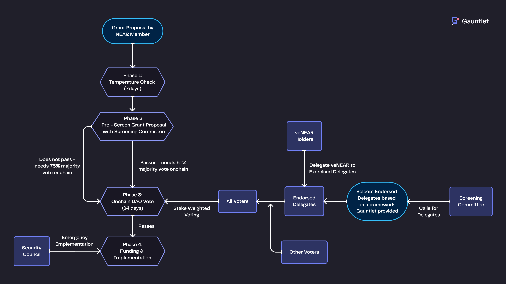

# Screening Committee {#screening-committee}

The Screening Committee is a core governance body in House of Stake. It serves as the first layer of review and quality control for proposals, delegates, and governance processes.

This group acts as a filter — helping ensure that only relevant, clear, and aligned proposals reach the broader voting audience.

**The initial Screening Committee consists of:**

- 3 members from [NEAR Foundation](https://near.foundation)
- 1 member from [Gauntlet](https://gauntlet.xyz)
- 1 member from [NearOne](https://nearone.org/)

Over time, new members will be elected by delegates annually.

## Responsibilities {#responsibilities}

- **Pre-screening proposals**: Review incoming proposals before they reach the main vote. If approved by the Committee (4 out of 7 votes), a proposal goes to simple majority voting. If not, it requires a supermajority (75%) to pass.

- **Initiating the Call for Delegates**: Launch the delegate application process, publish criteria, and coordinate selection of endorsed delegates.

- **Oversight**: Monitor delegate performance, enforce the Code of Conduct, and flag violations or conflicts of interest.

- **Reward adjustment**: Adjust veNEAR incentives over time to remain competitive with external yield opportunities.

- **Transparency**: Share decisions, meeting notes, and rationale with the community regularly.

**Governance Flow with Delegate Selection and Screening Oversight**

_This diagram shows how proposals move through the governance process and how the Screening Committee supervises both the grant flow and the Endorsed Delegates._

The Screening Committee plays two critical roles:

### Selection & Monitoring of Delegates {#selection-monitoring-of-delegates}

- **Initial Selection**: Chooses the first cohort of Endorsed Delegates
- **Ongoing Oversight**: Monitors delegates’ voting behavior on proposals
- **Intervention Power**: If a delegate acts against the code of conduct, the Committee may revoke a proposal’s approval, forcing a 75% supermajority for passage

### Management & Adjustment {#management-adjustment}

- **Performance Reviews**: Periodically assess the effectiveness of the process and delegates
- **Iterative Improvement**: Adjust frameworks and criteria to maintain alignment with protocol goals

Eventually, once the system matures, the Screening Committee will **transition authority** to the House of Delegates for selecting future Endorsed Delegates.
