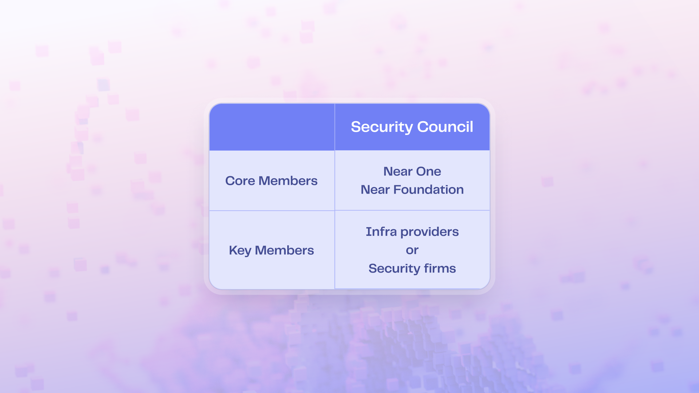

# Security Council

The Security Council is a critical governance body responsible for ensuring the security, integrity, and operational resilience of the NEAR protocol. It serves as a final line of defense in the governance architecture of House of Stake, particularly during emergencies or critical protocol upgrades.

## Purpose

The Security Council exists to:

- Respond to urgent threats or security vulnerabilities
- Coordinate emergency actions (e.g., halts, patch deployments)
- Provide oversight during sensitive governance transitions
- Maintain trust in the network during crises

## Structure

The Council is composed of two types of members:

- **Core Members**: Permanent representatives from foundational NEAR ecosystem organizations (e.g., Near Foundation,Near One)
- **Key Members**: Independent or semi-independent contributors with technical or strategic expertise

This tiered composition ensures both institutional stability and diverse perspectives.

## Responsibilities

- Initiate emergency interventions when necessary
- Inform the community within 7 days after emergency actions
- Monitor proposals for potential malicious behavior
- Coordinate with developers, validators, and governance participants during upgrades
- Oversee technical integrity of the governance system
- Support the Screening Committee in identifying security risks

## Accountability

Security Council members are expected to act in the best interest of the NEAR ecosystem. While their powers are reserved for exceptional circumstances, transparency and clear communication are required after any intervention.

Over time, the Council’s composition and powers may evolve through on-chain governance decisions as the system matures.

## Council Composition

The Security Council currently consists of **six members**, appointed by the **NEAR Foundation**. Every effort will be made to keep the membership up to date here, but the current set of member accounts is always visible on chain as the [members of the `hos-root.sputnik-dao.near` account](https://hos-root.near.page/hos-root.near/widget/app?page=settings&tab=members).

**Current Members:**
- `as.near` (Alex Shevchenko)
- `fastnear-hos.near` (Evgeny Kuzyakov)
- `c65255255d689f74ae46b0a89f04bbaab94d3a51ab9dc4b79b1e9b61e7cf6816` (Kendall Cole)
- `e953bb69d1129e4da87b99739373884a0b57d5e64a65fdc868478f22e6c31eac` (Bowen Wang)
- `lane.near` (Lane Rettig)
- `root.near` (Illia Polosukhin)
